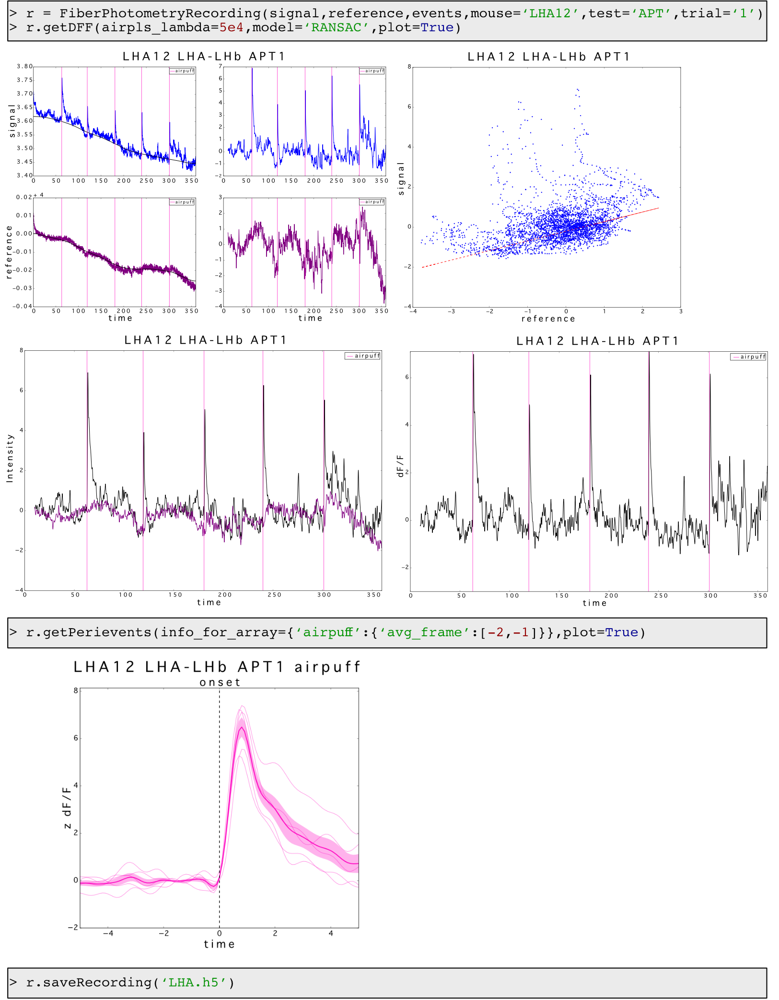
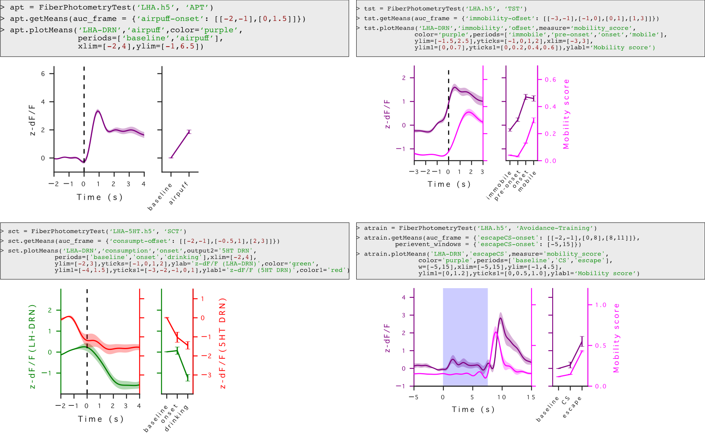
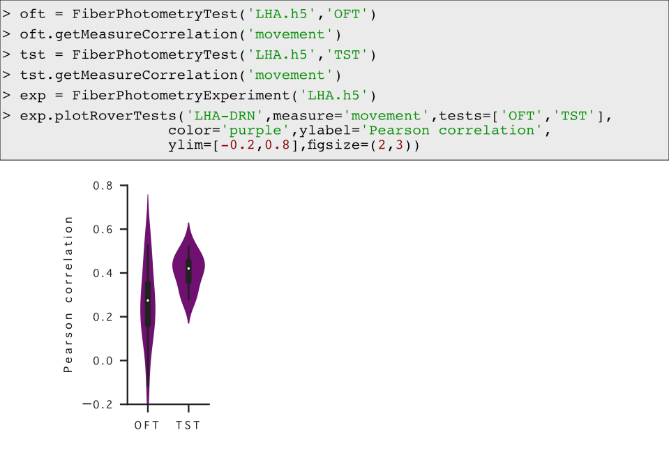
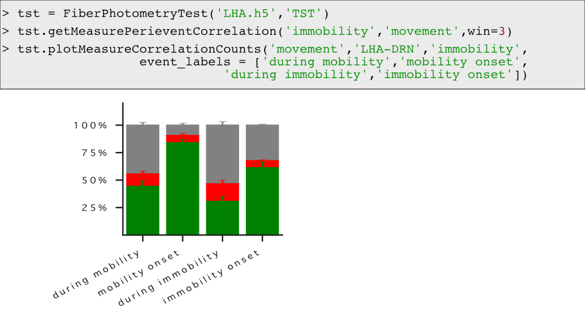
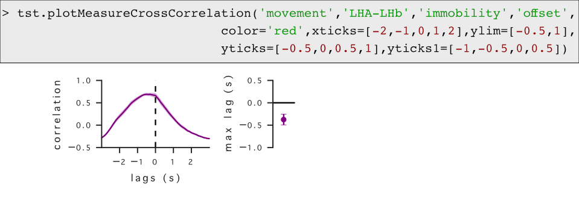

# Coherent activity at three major lateral hypothalamic neural outputs controls the onset of motivated behavior responses

This repository includes scripts and source data that were used in the following preprint: 
__Martianova, E., Pageau, A., Pausik, N., Doucet, T., Leblanc, D, Proulx, C.D.__ [_Coherent activity at three major lateral hypothalamic neural outputs controls the onset of motivated behavior responses._](https://www.biorxiv.org/content/10.1101/2021.04.28.441785v1) bioRxiv, doi: 10.1101/2021.04.28.441785v1, 2021.

[___FiberPhotmetryDataAnalysis.ipynb___](./FiberPhotometryDataAnalysis.ipynb) notebook includes functions necessary to process, analyze, and visualize fiber photometry data. Using these functions, jupyter notebooks in the [rawData](./rawData) folder show all the steps of analysis from raw data to the final [source data](./sourceData) and plots used in the figures of the preprint. The [sourceData](./sourceData) folder also includes jupyter notebooks showing stastical analysis done for the preprint.

# How to use functions

## Processing data
Using functions from [___FiberPhotmetryDataAnalysis.ipynb___](./FiberPhotometryDataAnalysis.ipynb), you can create _FiberPhotometryRecording_ object containing your recordings and with one line of code calculate dF/F signal and create perievent arrays:

```python
# Create dictionaries with your recordings, events, measurements
signals = {'Aneurons': signal_from_A, # The keys are names of neuronal populations, values are vectors of intensity.
           'Bneurons': signal_from_B} # You can add as many recordings as you have from the same animal.

references = {'Aneurons': reference_from_A, # The keys have to match the one in the signals.
              'Bneurons': reference_from_B}
              
time_ = yourTimeVector # All your recordings and time vectors have to be the same length.

events = {'event1': event1array, # You can add as many events as you have. Each event is a 2D array,
          'event2': event2array, # with 2 columns if it has onset and offset (e.g. consumption, immobility bouts),
          'event3': event3array} # with 1 column if it has only start (e.g. air puff, foot shock).
          
measurements = {'measure1': 'time': measure1time,   # The measurements can be for example speed or freezing score.
                          'values': measure1values} # The recording time of the measurements can be not the same as fiber photometry
                'measure2': 'time': measure1time,   # You can add as many measures as you have.
                          'values': measure1values} 
                          
# Create FiberPhotometryRecording object
r = FiberPhotometryRecording(signals,references,time_,events,
                             measurements,'mouse1name','test1name','trialNumber')
                             
# Calculate dF/F for all recordings
r.getDFF()
# Get a dF/F trace from one neuronal population
r.dFFs['Aneurons']

# Calculate perievent arrays for each neural population and each event
r.getPerievents()
# Get perievent array recorded from neurons A at the offset of event 3
r.Perievents['Aneurons']['event3']['offset']

# Save data to hdf file
r.saveRecording('HDFname.h5') # In the same HDF file, you can save several recordings from different mice, tests, and trials
```



If you set parameters plot and save to True, the functions create a folder 'figures', which contains plots of the steps of the data processing.

The pipeline of processing of fiber photometry data is explained in our JoVE paper:
__Martianova, E., Aronson, S., Proulx, C.D.__ [Multi-Fiber Photometry to Record Neural Activity in Freely Moving Animal.](https://www.jove.com/video/60278/multi-fiber-photometry-to-record-neural-activity-freely-moving). _J. Vis. Exp._ (152), e60278, doi: 10.3791/60278 (2019).
An example can be found in our other [github repo](https://github.com/katemartian/Photometry_data_processing).


## Analyzing data
Using FiberPhotometryTest object, you can calculate mean perievent traces per mouse.

```python
# Create FiberPhotometryTest object
test = FiberPhotometryTest('HDFname.h5','testName')

# Calculate means and area under curve (AUC)
test.getMeans()
# Or you can precise the frames for AUC (the default frames are -2s - -1s and +1s - +2s from an event)
test.getMeans(auc_frames={'event1-onset': [[-2,-1],[0,2]],
                          'event2-onset': [[-2,-1],[-0.5,1],[2,4]],
                         'event2-offset': [[-2, 0],[0, 2]]
                         'event3-offset': [[-3,-1],[-1,0],[0,1],[1,3]]})

# Plot means for neurons A at onset of event 1
test.plotMeans('neuronsA','event1','onset')

# Get a data frame of AUCs for all neural populations at onset of event 1
df = getDataFrameAUC('event1','onset',['before','after']) # The last argument sets names to AUC time frames
# You can use this data frame to do statistical analysis
```



You can also do correlation analysis between dF/F signal and measurement or dF/F signals of two neural populations. It can be total correlation across the whole recordings or at specific events. To plot the results across several tests, FiberPhotometryExperiment object can be used.

```python
# Total coorelation between dF/F and measure traces
# Create FiberPhotometryTest objects corresponding to one of the tests saved in HDF file.
test1 = FiberPhotometryTest('HDFname.h5','test1name')
test2 = FiberPhotometryTest('HDFname.h5','test2name')
# Calculate overall Pearson correlation between dF/F traces and measure1 traces.
test1.getMeasureCorrelation('measure1')
test2.getMeasureCorrelation('measure2')

# Create FiberPhotometryExperiment object
exp = FiberPhotometryExperiment('HDFname.h5')
# Plot distribution of R values for neurons A and measure 1 in tests 1 and 2
exp.plotRoverTests('Aneurons',measure='measure1',tests=['test1name','test2name']
# Get data frame of R values
df = exp.getDataFrameRmeasure('measure1',[test1name','test2name'])
```

The same can be done for correlation between dF/F traces of two neural populations

```python
# Total coorelation between dF/F traces of two neural populations
# Create FiberPhotometryTest objects corresponding to one of the tests saved in HDF file.
test1 = FiberPhotometryTest('HDFname.h5','test1name')
test2 = FiberPhotometryTest('HDFname.h5','test2name')
# Calculate overall Pearson correlation between dF/F traces of A and B neurons.
test1.getOutputCorrelation('Aneurons','Bneurons')
test2.getOutputCorrelation('aneurons','Bneurons')
 
# Create FiberPhotometryExperiment object
exp = FiberPhotometryExperiment('HDFname.h5')
# Plot distribution of R values for neurons A and measure 1 in tests 1 and 2
exp.plotRoverTests('Aneurons',output1='Bneurons',tests=['test1name','test2name'])
# Get data frame of R values for tests 1 and 2
df = exp.getDataFrameRoutputs([test1name','test2name'])
```



Correlation analysis can be done at recorded events and in between them. For more information check our [preprint](./2021.04.28.441785v1.full.pdf).

```python
# Create FiberPhotometryTest objects corresponding to one of the tests saved in HDF file.
test1 = FiberPhotometryTest('HDFname.h5','test1name')
# Calculate perievent correlation between dF/F and measure 1 at event 1 and between them
test1.getMeasurePerieventCorrelation('event1','measure1')

# Plot a number of positively, negatively, not correlated events
test1.plotMeasureCorrelationCounts('measure1','Aneurons','event1')

# Create FiberPhotometryExperiment object
exp = FiberPhotometryExperiment('HDFname.h5')
# Get data frame of the number of positively, negatively, not correlated events
df = exp.getDataFrameMeasureCorrCounts('measure1',['test1name','test2name'],['Aneurons','Bneurons'])
```

 

From the results of the previous perievent correlation analysis, you can plot cross correaltion.

```python
# Plot cross correlation between dF/F and measure 1 traces 
test1.plotMeasureCrossCorrelation('measure1','Aneurons','event1','offset')
# Get dataframe of cross correlation at offset of event 1
df = test1.getDataFrameCrossCorr('measure1','event1','offset')
```



The same analysis can be done between dF/F traces of two neural populations.

This explanation covers all the functions that were used to analyze data for the preprint.
